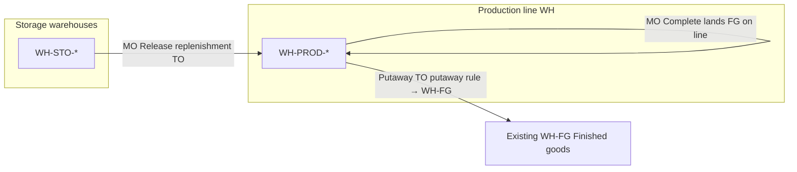

# Operational setup scripts (PVS site layout)

Idempotent scripts for **storage warehouses**, **production-line warehouses**, and **work centers**. Safe to re-run.

**Does not create** your finished-goods warehouse — use the one already in ERP (default code `WH-FG`). Edit [`config/site-layout.ts`](config/site-layout.ts) if your FG code differs.

## Warehouse vs godown (in this ERP)

There is **no separate “godown” record type**. Every physical location is one row in **Settings → Warehouses** (`Warehouse` in the database).

| Term on site | In ERP | What distinguishes behaviour |
|--------------|--------|------------------------------|
| Godown (colloquial) | `Warehouse` with `kind = storage` | Long-term raw / cold / FG stock |
| Production line area | `Warehouse` with `kind = production` | MO issue, WIP, **temporary** FG before putaway |
| “Finished goods godown” | Same table — your existing `WH-FG` | Putaway destination; not recreated by script |

Display names are free text (`name`). You can call every location “… Warehouse” in the UI; **`kind`** (`storage` | `production`) is what the app uses for logic, not the word godown.

To rename an existing location (e.g. `Finished Goods Godown` → `Finished Goods Warehouse`): **Settings → Warehouses** → edit name, or re-run `ops:site-setup` for codes defined in `site-layout.ts` (script upserts `name`).

## What this script creates

| Type | Examples |
|------|----------|
| Production-line WH (`kind=production`) | `WH-PROD-SNACKS`, `WH-PROD-SOAP`, `WH-PROD-VACUUM`, … |
| Raw / cold storage (`kind=storage`) | `WH-STO-OILSEEDS`, `WH-STO-MILLETS`, … |

**Not created:** finished-goods warehouse (e.g. existing `WH-FG`).

**Removed:** separate `WH-ANC-*` locations — the **production WH** is the temporary buffer for manufactured goods.

## Inventory flow



1. Materials replenished from storage warehouses → **production WH** (on MO release).
2. Manufacturing runs on **production WH** (issue / complete).
3. Finished goods sit temporarily on **production WH** bins.
4. On complete, if putaway rule destination = **WH-FG** (and ≠ line WH), ERP creates a **putaway transfer** to your existing finished-goods warehouse.

## Finished-goods putaway (automated)

After warehouses + work centers:

```bash
npm run ops:putaway-fg
```

Or as part of full setup (`run-all` includes step 03):

```bash
npm run ops:site-setup
```

This creates in **WH-FG** (or `EXISTING_FINISHED_GOODS_WH_CODE`):

- **One dedicated bin per active variant** (and per product without variants)
- **4 bins per shelf** (`01`–`04` on `S001`, `S002`, …)
- **Zones assigned pseudo-randomly per shelf** (stable shuffle A–Y on re-run)
- **Putaway rule** per SKU with fixed `toBinId` → that bin

Without a rule + bin, **MO complete** returns `no_putaway_bin` / `no_receive_bin`.

## Production lines

| Work center | Production WH | Putaway destination (configure in rules) |
|-------------|---------------|------------------------------------------|
| Snacks Room | `WH-PROD-SNACKS` | Existing `WH-FG` |
| Soap Room | `WH-PROD-SOAP` | Existing `WH-FG` |
| Vacuum Packing | `WH-PROD-VACUUM` | Existing `WH-FG` |
| Oil Room | `WH-PROD-OIL` | Existing `WH-FG` |
| Milling Room | `WH-PROD-MILL` | Existing `WH-FG` |
| Filter Room | `WH-PROD-FILTER` | Existing `WH-FG` |

Replenishment hints (storage → line) are in each work center description as `[ops] replenish=...`.

## Run

From `backend/`:

```bash
npm run ops:site-setup
npm run ops:site-setup -- --dry-run
```

VPS:

```bash
docker compose exec backend npx tsx ops-scripts/run-all.ts
```

## If FG warehouse code is not WH-FG

Change one line in `config/site-layout.ts`:

```ts
export const EXISTING_FINISHED_GOODS_WH_CODE = "WH-FG"; // your actual code
```

## Obsolete WH-ANC-* warehouses

An earlier version of this script created `WH-ANC-SNACKS`, etc. **`ops:site-setup` removes them automatically** (deletes when empty; deactivates if they still hold stock). Re-run setup after pulling the latest ops scripts.

## Related scripts

| Script | Purpose |
|--------|---------|
| [`../src/scripts/reset-test-environment.ts`](../src/scripts/reset-test-environment.ts) | Clear orders; keep catalog; seed test qty |
| [`../src/scripts/import-catalog.ts`](../src/scripts/import-catalog.ts) | Import products / price lists |
