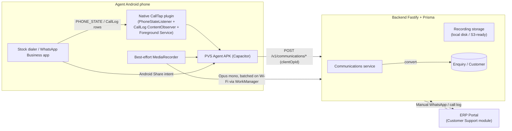

# Customer Support Agent App

> **Status:** Draft / planning. Captured for future revisions — not yet under
> active development. Last revised 2026-06-01.
>
> **Origin:** Plan composed in chat after the Capacitor warehouse-mobile
> consolidation. Two architecture decisions were locked in by the product
> owner:
>
> 1. **Telephony**: on-device capture on agents' personal Android phones
>    (no cloud telephony provider in this iteration).
> 2. **WhatsApp**: manual logging via Android's native share intent (no
>    Meta Business API, no scraping).
>
> Cloud-telephony and WhatsApp-Cloud-API ingest paths are explicitly left
> as future hooks — the schema below is provider-agnostic so they slot in
> without re-plumbing.

## Outcome

- Every inbound/outbound call to/from a support agent's phone is auto-logged
  in PVS-ERP within seconds, with caller, direction, duration and a one-tap
  "Convert to Enquiry / Support Ticket".
- Agents log WhatsApp chats in two taps via Android's native **Share** menu
  (no Meta API, no scraping).
- Admins get a Customer Support inbox + Quality review screen with optional
  best-effort call recordings, retention controls, and a consent script —
  all role-gated.
- Designed for **zero impact on call quality**: no in-call UI, foreground
  service only while a call is active, all uploads batched on Wi-Fi.

## Scope and constraints

- **Telephony**: on-device capture on agents' personal Android phones.
  Cloud telephony (Exotel/Twilio) and an iOS agent are explicitly
  out-of-scope but the schema is provider-agnostic so they can be added
  later as ingest adapters.
- **WhatsApp**: manual logging using Android's share intent + a
  paste/screenshot form. No Business API, no scraping.
- **Recording reality** (must be communicated to admins in the UI):
  Android 10+ blocks third-party voice-call recording for the microphone.
  The plugin will attempt `MediaRecorder.AudioSource.VOICE_RECOGNITION`
  and surface "Recording: working / silent / not permitted" status per
  device. Metadata capture (caller, direction, duration, ring/answer/end
  events) is fully reliable.
- **Compliance**: org-level recording toggle is OFF by default. When ON,
  admins must set a consent script that agents are required to read.
  Recording playback is audit-logged. Default 30-day retention with a
  nightly purge job.

## Architecture

## Data model — extend [`backend/prisma/schema.prisma`](../backend/prisma/schema.prisma)

New migration `prisma/migrations/<ts>_add_communications/migration.sql`:

- `Communication`
  - `id`, `channel` (`call | whatsapp | sms | email`), `direction`
    (`inbound | outbound | missed`)
  - `externalNumber`, `externalHandle?` (raw WhatsApp number / email)
  - `agentUserId` (→ `User`), `customerId?` (→ `Customer`, best-effort
    match by phone)
  - `startedAt`, `endedAt?`, `durationSec?`
  - `status` (`captured | logged | converted | dismissed`)
  - `summary?` (agent's free-text), `outcome?`, `tags String[]`
  - `enquiryId?` (→ `Enquiry`, set on convert)
  - `recordingStatus` (`none | uploaded | failed | silent`)
  - `clientOpId` (unique, idempotent ingest)
  - `provider` (`device_android | manual_web | exotel | …`) — reserved
    for future
  - `createdAt`, `updatedAt`
  - Indexes: `agentUserId`, `customerId`, `enquiryId`, `startedAt`,
    `status`
- `CommunicationAttachment`
  - `id`, `communicationId`, `kind` (`audio | image | text | transcript`),
    `url`, `mime`, `bytes`, `createdAt`
- Extend `Enquiry.type` enum docstring to include `support` (no schema
  change — `type` is a free `String`); update
  [`backend/src/routes/enquiries.ts`](../backend/src/routes/enquiries.ts)
  `TYPES` zod enum to add `"support"`.
- Add optional `communicationId` to `EnquiryActivity` so any activity can
  be traced back to its source touchpoint.
- Org settings (reuse the existing `Setting` key/value table — no new
  model): `telephony.recordingEnabled` (bool), `telephony.retentionDays`
  (int, default 30), `telephony.consentScript` (string).

## Backend — new file `backend/src/routes/communications.ts`

Routes (all under `/v1/communications`, JWT-auth, role-gated):

- `POST /calls/ingest` (agent role) — body:
  `{ clientOpId, direction, externalNumber, startedAt, endedAt?, durationSec?, eventType }`.
  Creates/updates a `Communication` row idempotently. Best-effort match
  `Customer` by `contact` phone.
- `POST /:id/recording` (agent role) — multipart audio upload; sets
  `recordingStatus = uploaded`; stores under
  `backend/uploads/recordings/<yyyy>/<mm>/<id>.opus`.
- `POST /whatsapp/log` (agent or admin) — body:
  `{ direction, externalNumber, body, screenshotBase64?, customerId?, startedAt? }`.
  Creates a `Communication` + optional image attachment.
- `GET /` — list with filters: `channel`, `status`, `agentId`,
  `customerId`, `from`, `to`, `q`. Paged. Enforces role: agents see own
  + assigned, admins see all.
- `GET /:id` — full detail (without recording bytes) + signed playback
  URL valid for 5 min.
- `GET /:id/recording` — streams audio; **logged in `AuditLog`** with
  userId + commId.
- `POST /:id/convert` — body:
  `{ to: "enquiry" | "ticket", priority?, subject? }`. Creates an
  `Enquiry` (with `type = "product"` or `"support"`) using the existing
  enquiry-create logic, links via `communicationId`, returns
  `{ enquiryId }`.
- `PATCH /:id` — agent edits own log; admin can tag/rate (`tags`,
  `qualityRating`, `bestPractice` flag).
- New routes for settings via existing
  [`backend/src/routes/settings.ts`](../backend/src/routes/settings.ts):
  `GET/PUT /v1/settings/telephony`.

Wire-up in [`backend/src/index.ts`](../backend/src/index.ts):
`app.register(commsRoutes, { prefix: "/v1" })`.

Add a nightly retention job (extend
[`backend/src/scripts`](../backend/src/scripts)): delete recording files
+ clear `recordingStatus` for `Communication` older than `retentionDays`.

## Web portal — new module under [`erp-portal/src/pages`](../erp-portal/src/pages)

- `erp-portal/src/pages/CustomerSupport.tsx` — top-level page with three
  tabs (URL: `/customer-support?tab=inbox|tickets|quality`):
  - **Inbox**: paginated table of `Communication` rows, channel/agent/date
    filters, fast search; row click opens drawer with audio player,
    transcript/notes, attachments, customer card, "Convert → Enquiry" or
    "Convert → Support Ticket" buttons.
  - **Tickets**: filtered Enquiry list where `type = support`, reuses
    the existing
    [`erp-portal/src/pages/Enquiries.tsx`](../erp-portal/src/pages/Enquiries.tsx)
    table with a `type=support` query param so we don't fork the code.
  - **Quality** (admin only): unrated communications first, rate 1-5
    stars, tag (`great_intro | resolved | escalation | needs_coaching | best_practice`).
    Aggregates per-agent.
- New component `erp-portal/src/components/support/WhatsappLogModal.tsx`
  — paste body, attach screenshot, pick customer, post to
  `/v1/communications/whatsapp/log`. Reachable from any customer page.
- Settings: extend
  [`erp-portal/src/pages/Settings.tsx`](../erp-portal/src/pages/Settings.tsx)
  with a **Telephony & Recording** card — enable toggle, consent script
  textarea (with default suggestion), retention slider, list of agents
  with per-agent enable.
- Navigation: add "Customer Support" link in
  [`erp-portal/src/components/shell/LeftNavigation.tsx`](../erp-portal/src/components/shell/LeftNavigation.tsx)
  (icon `Headphones`), add palette commands in
  [`erp-portal/src/components/shell/CommandPalette.tsx`](../erp-portal/src/components/shell/CommandPalette.tsx),
  register the route in
  [`erp-portal/src/App.tsx`](../erp-portal/src/App.tsx).
- API client additions in
  [`erp-portal/src/lib/api.ts`](../erp-portal/src/lib/api.ts):
  `communications`, `communication`, `convertCommunication`,
  `logWhatsapp`, `telephonySettings`, `updateTelephonySettings`.

## Agent mobile app — new Capacitor flavor

Reuse the existing slim-build pattern in
[`erp-portal/src/main.tsx`](../erp-portal/src/main.tsx):

- New entry `erp-portal/src/AgentApp.tsx` with routes only under `/a/*` —
  login, queue, log detail, customer search, profile, whatsapp share
  landing.
- New screens under `erp-portal/src/agent/screens/`:
  - `AgentLogin.tsx` (shares JWT logic with `MobileLogin`)
  - `AgentQueue.tsx` — today's calls + WhatsApp logs, "unlogged" filter
    on top
  - `AgentLogDetail.tsx` — quick form: notes, outcome, tag customer,
    convert button
  - `AgentWhatsappShare.tsx` — landing page when Android share-intents
    data into the app
  - `AgentCustomer.tsx` — recent comms + enquiries for a customer
  - `AgentProfile.tsx` — recording opt-in toggle, plugin status badge
- Mode wiring in
  [`erp-portal/src/main.tsx`](../erp-portal/src/main.tsx): extend the
  existing `MOBILE_BUILD` switch to also handle
  `import.meta.env.MODE === "agent"` and dynamic-import `AgentApp`.
  Update [`erp-portal/vite.config.ts`](../erp-portal/vite.config.ts) to
  support the `agent` mode in the same `manualChunks` block.
- New build scripts in
  [`erp-portal/package.json`](../erp-portal/package.json): `build:agent`
  mirroring `build:mobile` (`vite build --mode agent`).
- New Capacitor wrapper folder `mobile-agent/` mirroring
  [`mobile-erp/`](../mobile-erp):
  - App ID `com.prakruthivanam.agent`, name "PVS Agent".
  - `sync-agent.mjs` script (clone of `sync-mobile.mjs`).
  - `build:android` script chained to `build:agent` + `cap sync` +
    `gradlew assembleDebug`.
  - Reuses the same `arm64-v8a` only ABI filter for size.

## Native call-tap plugin

Path: `mobile-agent/android/app/src/main/java/com/prakruthivanam/agent/CallTapPlugin.kt`

Custom Capacitor plugin (Kotlin) exposing JS API `CallTap.start()`,
`CallTap.stop()`, `CallTap.status()`, event `callEvent`:

- `PhoneStateListener` (or `TelephonyCallback` on API 31+) for
  `RINGING / OFFHOOK / IDLE`.
- `ContentObserver` on `CallLog.Calls.CONTENT_URI` for missed-call
  backfill on `IDLE`.
- `ForegroundService` (type `phoneCall`) started only while a call is
  active; stopped on `IDLE` after a 5-second debounce — minimises
  battery.
- Each event posts to JS layer with
  `{ direction, number, ts, eventType }`. JS layer queues to local
  SQLite via `@capacitor-community/sqlite` and POSTs
  `/v1/communications/calls/ingest` with `clientOpId = uuid`
  (idempotency parity with picking/packing).
- Optional best-effort `MediaRecorder` (gated by org setting + per-agent
  opt-in): tries `VOICE_RECOGNITION` source, writes to app-private dir,
  queues upload via Capacitor Background Tasks (or a JS-level
  WorkManager-equivalent: enqueue + retry on online + Wi-Fi). On
  Android 10+ falls back to "silent recording detected" status surfaced
  in `AgentProfile`.
- Permissions in `AndroidManifest.xml`: `READ_PHONE_STATE`,
  `READ_CALL_LOG`, `READ_CONTACTS` (caller-id enrichment),
  `POST_NOTIFICATIONS`, `FOREGROUND_SERVICE`,
  `FOREGROUND_SERVICE_PHONE_CALL`, `RECORD_AUDIO` (only requested when
  recording opt-in is toggled).

## WhatsApp share-target

Add to `mobile-agent/android/app/src/main/AndroidManifest.xml` on
`MainActivity`:

- `<intent-filter>` for `android.intent.action.SEND` with `text/plain`
  and `image/*`.
- App label appears in the system Share sheet as "Log to PVS".
- A small `share-receiver.ts` web-side handler reads the launch URL /
  intent, navigates to `/a/whatsapp/share` with payload pre-filled.

## Phasing & deliverables

1. **Schema + backend `Communication` model + CRUD + convert + manual
   WhatsApp endpoint** (testable via Postman).
2. **Web Customer Support module: Inbox + Tickets + Quality +
   Settings/Telephony** (manual logging works fully without any phone).
3. **Agent Capacitor flavor scaffolding** (new build pipeline, login,
   queue, manual log forms — same APIs as web).
4. **Native CallTap plugin: metadata only** (no recording yet) — 95% of
   value, zero compliance risk.
5. **Best-effort recording + retention job + audit log** — gated behind
   admin toggle, off by default.
6. **WhatsApp Android share-target** + `AgentWhatsappShare.tsx` landing.
7. **Quality dashboard aggregates + per-agent stats**.

Future hooks (called out in code comments, not built):

- Cloud-telephony provider adapter (Exotel / Twilio webhook → same
  `Communication` ingest).
- WhatsApp Business Cloud API ingest.
- LLM transcription / summarization (`provider="openai_whisper"`
  reserved on `Communication`).

## Performance & non-interference guarantees

- No UI overlay during a call; agent only sees a low-priority post-call
  notification.
- Foreground service starts on `OFFHOOK`, stops on `IDLE` + debounce.
- Metadata payloads are < 500 bytes; recording uploads run via
  Background Tasks constrained to `unmetered + idle`.
- Native plugin uses `TelephonyCallback` (API 31+) or
  `PhoneStateListener` (< 31) — passive listener, no polling.
- Agent app idle CPU/battery target: < 1% per day per device.

## Out of scope (this iteration)

- iOS agent app (Apple disallows call-state APIs entirely; would require
  cloud telephony).
- Auto WhatsApp message scraping.
- Real-time live-call coaching / whisper.
- LLM transcription (groundwork laid; not wired).

## Open questions for the next revision

These are the decisions to revisit before committing to development:

1. **Recording reliability vs. cloud telephony cost.** If best-effort
   on-device recording proves unusable on the team's actual phones,
   re-evaluate moving to a cloud telephony provider (Exotel / Knowlarity
   / MyOperator) where recording is built-in and 100% reliable. Estimate
   typical cost: ₹2–5k/month base + per-minute usage.
2. **Enquiry vs. dedicated `SupportTicket` model.** The current plan
   piggybacks on `Enquiry.type = "support"` to avoid duplication. If
   support tickets need a meaningfully different lifecycle (SLAs,
   escalation, CSAT, knowledge-base linkage) we may want a separate
   `SupportTicket` model with its own pipeline.
3. **Per-agent device policy.** Personal phones vs. company-issued. MDM
   enrolment would unlock OEM-level call recording on some Samsung /
   Xiaomi devices but adds operational overhead.
4. **Consent automation.** Without cloud telephony we cannot play an
   automatic IVR consent message before connecting. Decide if a
   pre-call consent script the agent reads aloud is sufficient for
   DPDP Act compliance, or if recording must wait for cloud telephony.
5. **Storage backend.** Local disk works for the pilot; S3-compatible
   storage is recommended once recordings are enabled at scale.
   Mark this as a config flag from day 1.
