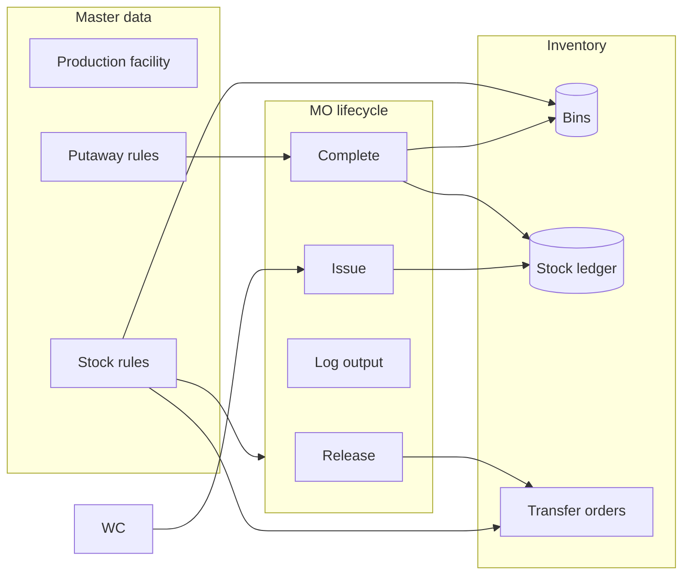
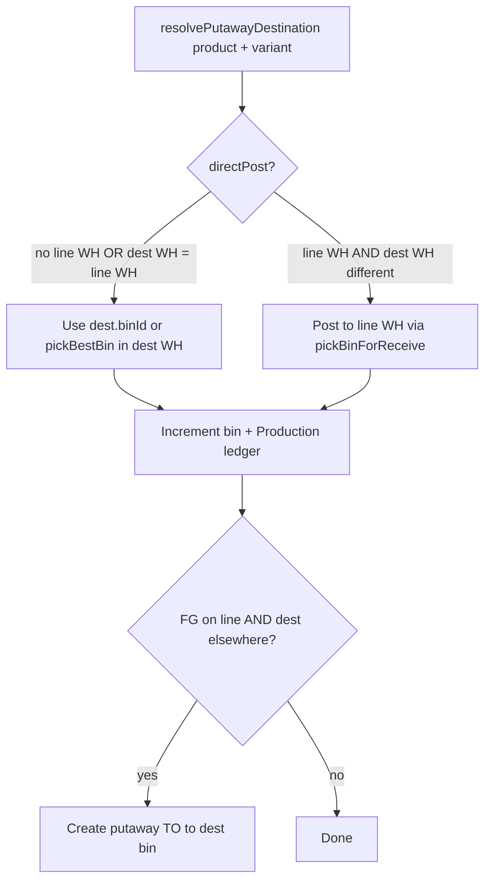

# Manufacturing inventory & storage

How raw materials and finished goods move through warehouses and bins in PVS ERP: production orders, putaway rules, stock rules, and transfer orders.

**Design principle:** A manufacturing order (MO) is a **workflow record**. Physical stock always lives in **bins** (`Bin.qty`). Every movement is recorded in **StockLedger** with `ref` = the MO or transfer number.

---

## Feature overview

| Feature | Purpose | Where to configure |
|---------|---------|-------------------|
| **Bins** | Physical locations (`zone/shelf/bin`) per warehouse | Settings → Warehouses; Inventory |
| **Work center + production-line WH** | Where the line runs; where issue pulls from | Settings → Production lines |
| **Putaway rules** | Fixed destination bin per product/variant after MO complete | Settings → Putaway rules |
| **Stock rules** | Min qty on a bin → auto MO or auto transfer | Settings → Stock rules |
| **Transfer orders** | Replenishment, putaway, manual moves | Manufacturing MO card; mobile |
| **MO inventory trail** | Read-only history of issue/complete bins | Manufacturing → order detail |



---

## Core data model

### Bin (`Bin`)

| Field | Meaning |
|-------|---------|
| `warehouseId` | Parent warehouse |
| `zone`, `shelf`, `bin` | Location path (shown as `A/S1/B2`) |
| `productId` | Product currently assigned to slot (nullable) |
| `qty` | On-hand quantity (**source of truth**) |
| `reservedQty` | Reserved for pick lists; free = `qty - reservedQty` |
| `capacity` | Max qty hint for receive logic |

Bins are keyed by **parent product**, not variant. Variant-level counters use `ProductVariant.stockOnHand`; putaway/stock rules tie variants to specific bins via configuration.

### Stock ledger (`StockLedger`)

| Field | Meaning |
|-------|---------|
| `txnType` | `Issue`, `Production`, `Transfer`, `Sale`, `Adjust`, `in`, `out`, etc. |
| `ref` | Document reference (e.g. `MO-2026-2214`, `TRF-2026-0001`) |
| `qty` | Signed delta |
| `bin` | Path string at time of posting |

### Warehouse kinds

| `kind` | Typical use |
|--------|-------------|
| `storage` | Long-term FG and raw material storage |
| `production` | Shop-floor / line buffer (`WH-PROD-*`) |

Each **production facility** owns one `productionLineWarehouse` (1:1, shared by all its lines). Issue materials prefer that warehouse when set.

### Putaway rule (`PutawayRule`)

Declares where finished goods should land after production.

| Field | Required | Purpose |
|-------|----------|---------|
| `productId` | Yes | Finished product |
| `variantId` | No | Variant-specific rule (wins over product-level) |
| `toWarehouseId` | Yes | Destination warehouse |
| `toBinId` | **Yes in UI** | Fixed bin — **no empty-bin auto-pick in Settings** |
| `priority` | No | Lower number = higher priority (default 100) |
| `active` | No | Enable/disable rule |

**Resolution order** (`backend/src/lib/putaway.ts`):

1. Active variant-specific rule (lowest `priority`)
2. Active product-level rule (`variantId` null)
3. Fallback: `landingWhId` from facility or request body, else first active storage warehouse

### Stock rule (`StockRule`)

Monitors one bin; when `bin.qty < minQty`, creates automation.

| Field | Required | Purpose |
|-------|----------|---------|
| `productId` | Yes | Product being monitored |
| `variantId` | No | Scope rule to one variant |
| `monitorBinId` | Yes | Bin whose qty is watched (usually FG shelf) |
| `minQty` | Yes | Threshold (e.g. 20) |
| `triggerType` | Yes | `mo` or `transfer` |
| `bomId` | For `mo` | BOM used; **`plannedQty` = `Bom.outputQty`** (batch size) |
| `sourceBinId` | For `transfer` | Bin to pull stock from |
| `toBinId` | No | Destination (defaults to `monitorBinId`) |
| `tags` | No | Comma-separated labels on auto transfer (team routing) |
| `active` | No | Enable/disable |

**Dedup guards:**

- **MO trigger:** Skips if an open MO already exists for same `bomId` (`planned`, `in-progress`, `qc`, `delayed`).
- **Transfer trigger:** Skips if an open TO exists with `notes` containing `StockRule:{ruleId}`.

### Transfer order (`TransferOrder`)

| `kind` | Created by | Direction |
|--------|------------|-----------|
| `replenishment` | MO **Release** or **stock rule** | Storage → production line (or monitor bin) |
| `putaway` | MO **Complete** (line ≠ storage dest) | Production line → storage |
| `manual` | Operator | Any → any |

| Field | Purpose |
|-------|---------|
| `tags` | Comma-separated team labels (e.g. `cold-storage, night-shift`) |
| `productionOrderId` | Back-link to MO when auto-created |
| `assignedToId` | Mobile handler |

Status: `draft` → `ready` → `in_transit` → `done` (or `cancelled`).

---

## Manufacturing order lifecycle

### Status flow

```
planned → in-progress → (optional qc) → completed
         delayed (flag, non-blocking)
```

### Steps and inventory effects

| Step | API | MO status | Buttons (ERP) | Inventory |
|------|-----|-----------|-----------------|-----------|
| Create MO | `POST /production-orders` | `planned` | — | None |
| **Release** | `POST /production-orders/:id/release` | stays `planned` if short | Only while `planned` | Replenishment TOs if line WH short |
| **Issue materials** | `POST /production-orders/:id/issue-materials` | `in-progress` | Disabled when all issued or completed | `Issue` ledger −qty; bins decremented; **stock rules** checked on each source bin |
| **Log output** | `POST /production-orders/:id/log-output` | `in-progress` | Only `in-progress` / `qc` | Updates `actualQty` only |
| **Complete** | `POST /production-orders/:id/complete` | `completed` | Disabled when completed or no output | FG posted to putaway bin; `Production` ledger +qty; optional putaway TO |

### Release (`POST /production-orders/:id/release`)

- Only allowed when MO status is **`planned`**.
- Explodes BOM; checks stock at **facility production warehouse** (if the MO's facility has one).
- Creates **replenishment** transfer orders from storage bins to the line for shortages.
- Does not consume stock.

### Issue materials (`POST /production-orders/:id/issue-materials`)

- Blocked when MO is **completed** or when **all materials already issued** (409 `materials_already_issued`).
- When production-line WH is set, may require **Release** first if `requireMoReleaseBeforeIssue` is enabled on company profile.
- Drains bins per BOM leaf; writes `Issue` (or legacy `out`) ledger rows with `ref = orderNo`.
- Decrements `Product.stockOnHand`.
- After each decremented bin: runs **`checkStockRules(binId)`** (may auto-create MO or transfer).

### Requirements panel (`GET /production-orders/:id/requirements`)

Shows multi-level BOM explosion vs bins:

| Column | Meaning |
|--------|---------|
| `required` | BOM need for remaining plan qty |
| `issued` | Already issued to this MO (from ledger) |
| `stillNeeded` | `max(0, required - issued)` |
| `shortage` | `max(0, stillNeeded - free bin qty)` — **not** “full BOM vs bins after issue” |

Flags: `allFullyIssued`, `materialsIssued`, `anyShortage`.

**Issue materials** button is disabled when `allFullyIssued` is true.

### Complete (`POST /production-orders/:id/complete`)

Uses **`resolvePutawayDestination`** first (putaway rules), then chooses receive bin:



- **`directPost`:** No production-line WH, or destination warehouse equals line WH → post straight to putaway destination.
- **Fixed `toBinId`:** Loads that bin directly (no empty-bin fallback when `fixedBin`).
- **Rule with warehouse only:** `pickBestBin` may use existing product bin or empty slot (`allowEmptyBinFallback: true`).
- **No bin found:** 409 `no_receive_bin` — configure a putaway rule with destination bin.
- **Two-step putaway TO:** Only when FG lands on **production-line** bin and putaway rule points to a **different** warehouse.

Ledger: `txnType: Production`, `ref: orderNo`.

---

## Operating models

### Distant facility (make at A, store at B)

**Best when:** Production at one site; salable stock in central storage bins.

**Setup checklist**

- [ ] Work center with **production-line warehouse** (Settings → Production lines → **Auto-create** or link WH)
- [ ] BOM **default facility** (+ optional default line) (+ `variantId` on BOM if applicable)
- [ ] **Putaway rules:** product, variant, warehouse, **destination bin** (required in UI)
- [ ] Bins at line WH and at each destination bin
- [ ] Optional **stock rules** on FG monitor bins

**Runtime**

1. Release → replenishment TOs to line  
2. Issue → consume from line WH only  
3. Log output  
4. Complete → FG on line bin → putaway TO to storage bin from rule  
5. Mobile: pick/drop putaway TO  

### Co-located (same building / same warehouse)

**Best when:** Manufacturing and storage share one site.

**Setup checklist**

- [ ] Putaway rules with **fixed `toBinId`** in storage WH (e.g. `STR`)
- [ ] Either **no** facility production WH, **or** line WH = same site as storage rule

**Runtime**

- With **no** line WH: Complete posts **directly** to putaway rule bin (`directPost`).
- With line WH **same** as rule warehouse: Same direct post — no putaway TO.
- With line WH **different** from storage: Two-step (line → putaway TO) as distant model.

---

## Putaway rules (Settings)

**Path:** ERP Portal → **Settings → Putaway rules**

| UI field | Maps to |
|----------|---------|
| Product | `productId` |
| Variant | `variantId` (optional; blank = all variants) |
| Destination warehouse | `toWarehouseId` |
| Destination bin * | `toBinId` (**required** when creating in UI) |
| Priority | `priority` |

**Operator rule:** One rule per variant (or SKU) with a **dedicated bin**. Do not rely on “auto-pick empty bin” for FG — the UI blocks saving without a bin.

**API:** `GET/POST/PATCH/DELETE /v1/putaway-rules` (also under transfers router).

---

## Stock rules (Settings)

**Path:** ERP Portal → **Settings → Stock rules**

### Trigger type: Auto manufacturing order (`mo`)

When `monitorBin.qty < minQty`:

- Creates **planned** MO from `bomId`
- `plannedQty = Bom.outputQty` (batch size from BOM, not shortage qty)
- Facility/line from BOM default facility/line
- Skips if open MO already exists for that BOM

### Trigger type: Auto transfer (`transfer`)

When `monitorBin.qty < minQty`:

- Creates **replenishment** TO (`status: ready`)
- `fromBinId` = configured source bin
- `toBinId` = rule `toBinId` or `monitorBinId`
- `qtyRequested` = shortage amount (capped by source bin qty)
- `tags` copied to transfer order for team filtering
- Skips if open TO already exists for this rule (note marker)

### When rules are evaluated automatically

| Event | Bins checked |
|-------|----------------|
| MO issue materials | Each bin decremented during issue |
| Invoice / sale | Monitor bins for sold product/variant (bin decremented when possible) |
| Inventory adjust (negative qty) | Adjusted bin |
| Transfer pick | Source bins |
| Transfer drop | Destination bins |

### Manual sweep

**Check all now** → `POST /v1/stock-rules/check-all`  
Runs `checkStockRules` for every distinct `monitorBinId` on active rules.

**API:** `GET/POST/PATCH/DELETE /v1/stock-rules`

---

## Transfer orders and team tags

**Tags** on `TransferOrder` (`tags` column): comma-separated string, e.g. `cold-storage, night-shift`.

- Set on **stock rule** auto-transfers
- Set on manual TO create (`POST /v1/transfer-orders` body `tags`)
- Use for mobile task lists / filtering (filter by tag in UI as you extend mobile)

**Lifecycle APIs:** `claim`, `pick`, `drop` under `/v1/transfer-orders/:id/...`

Pick decrements source bin and may trigger stock rules. Drop increments destination bin and may trigger stock rules.

---

## Manufacturing UI (ERP Portal)

### Order detail actions

| Button | Enabled when |
|--------|----------------|
| **Release** | `status === planned` |
| **Issue materials** | Not completed; not `allFullyIssued` |
| **Log output** | `in-progress` or `qc` |
| **Complete** | Not completed; `actualQty > 0` |

### Cards on MO detail

1. **Work orders** — stage progress  
2. **Inventory locations** — ledger-based trail (`GET /inventory-trail`)  
3. **Transfer orders** — linked TOs  
4. **Material requirements** — explosion, issued/still needed, shortage; link to Inventory → Adjust  

### Inventory locations card

| Section | Source |
|---------|--------|
| Materials consumed | Negative ledger rows (`Issue` / `out`) for `ref = orderNo` |
| Finished goods stored at | Positive ledger (`Production` / `in`) |
| Planned moves | Linked transfer orders with from/to bin hints |

---

## Inventory adjustments

**Inventory → Adjust** (`POST /v1/inventory/adjust`)

- Updates a specific **bin** (preferred) + ledger `Adjust`
- Recomputes `Product.stockOnHand` from sum of bins
- Negative adjust triggers **`checkStockRules`** on that bin

Deep link from Manufacturing shortage row:  
`/inventory?adjust=1&from=mfg&productId=...&delta=...`

---

## BOM batch size

| Field | Meaning |
|-------|---------|
| `Bom.outputQty` | Units of finished output per BOM run (default 1) |
| Auto MO from stock rule | `plannedQty = outputQty` |

Component quantities in explosion are scaled by `outputQty`.

---

## Production-line warehouse setup

**Settings → Production lines → Work centers**

| Action | Result |
|--------|--------|
| **Auto-create** on new facility | Creates `WH-PROD-{FAC_CODE}`, `kind: production`, default bin `PROD/01/01` |
| **Edit → Prod. warehouse** dropdown | Link existing warehouse |

**Script (bulk backfill):** `backend/scripts/backfill-production-warehouses.ts`

---

## Company settings

| Setting | Effect |
|---------|--------|
| `requireMoReleaseBeforeIssue` | Issue blocked at line WH until Release when enabled |
| `Product.reorderLevel` | Legacy product-level hint (reports); **stock rules** replace per-bin min logic |

---

## API reference (authenticated `/v1`)

### Manufacturing

| Method | Path | Notes |
|--------|------|-------|
| GET | `/production-orders/:id/requirements` | Explosion + issued + shortage |
| GET | `/production-orders/:id/inventory-trail` | Bin/ledger summary for MO |
| POST | `/production-orders/:id/release` | Planned only |
| POST | `/production-orders/:id/issue-materials` | Returns `stockRuleTriggers` if any |
| POST | `/production-orders/:id/log-output` | |
| POST | `/production-orders/:id/complete` | Putaway + optional `putawayTransferOrderId` |

### Putaway & stock rules

| Method | Path |
|--------|------|
| GET/POST/PATCH/DELETE | `/putaway-rules` |
| GET/POST/PATCH/DELETE | `/stock-rules` |
| POST | `/stock-rules/check-all` |

### Transfers

| Method | Path |
|--------|------|
| GET/POST | `/transfer-orders` |
| POST | `/transfer-orders/:id/pick`, `/drop`, `/claim`, `/cancel` |

### Inventory

| Method | Path |
|--------|------|
| POST | `/inventory/adjust` |
| GET | `/ledger` |

---

## Key source files

| Area | Path |
|------|------|
| MO routes | `backend/src/routes/manufacturing.ts` |
| Putaway resolution | `backend/src/lib/putaway.ts` |
| Stock rule engine | `backend/src/lib/stock-rules.ts` |
| Stock rule CRUD | `backend/src/routes/stock-rules.ts` |
| Putaway + transfer CRUD | `backend/src/routes/transfers.ts` |
| Inventory adjust | `backend/src/routes/inventory.ts` |
| Billing + monitor bins | `backend/src/routes/billing.ts` |
| Schema | `backend/prisma/schema.prisma` |
| Settings UI | `erp-portal/src/pages/Settings.tsx` |
| Manufacturing UI | `erp-portal/src/pages/Manufacturing.tsx` |
| API client | `erp-portal/src/lib/api.ts` |
| Migration | `backend/prisma/migrations/20260531120000_stock_rules_and_to_tags/` |

---

## Example: MO-2026-2214

Legacy MO before full putaway/facility setup:

| Event | Location |
|-------|----------|
| Materials issued | `STR` · `A/S1/B2` (−99), `SMK/S1/01` (−100) |
| FG on complete | `STR` · `C/S1/B4` (+90, SKU 6RKS) |
| Putaway TO | None — no facility production WH configured |

**To align with current features:** assign facility + production WH, add putaway rule (variant + **fixed bin**), optional stock rule on `C/S1/B4` with min qty 20 and BOM for auto-replenish MO.

---

## Recommended setup sequence (greenfield)

1. **Warehouses** — Create storage WH(s); create bins.  
2. **Production lines** — Work center + production-line WH (auto-create).  
3. **BOMs** — Default work center; variant on BOM if needed; set `outputQty` batch size.  
4. **Putaway rules** — Every sellable variant → fixed destination bin.  
5. **Stock rules** — Monitor bins → min qty → MO or transfer + tags.  
6. **Run MOs** — Release → Issue → Log → Complete; execute TOs on mobile.  
7. **Monitor** — Manufacturing **Inventory locations** + Settings **Check all now**.

---

## Future enhancements (not implemented)

| Item | Notes |
|------|-------|
| `variantId` on `Bin` | Physical variant-level bin stock |
| Mobile filter by `TransferOrder.tags` | Schema ready; UI filter TBD |
| Scheduled stock-rule job | Today event-driven + manual check-all |
| Putaway rule without `toBinId` in UI | API allows; UI requires bin for operator clarity |

*Last updated: 2026-06-15 — reflects ProductionFacility/ProductionLine refactor: work centers split into facility (room) + lines (floor lines); MOs now carry `facilityId` (required) and `lineId` (supervisor-assigned); BOM defaults updated to facility + line.*
