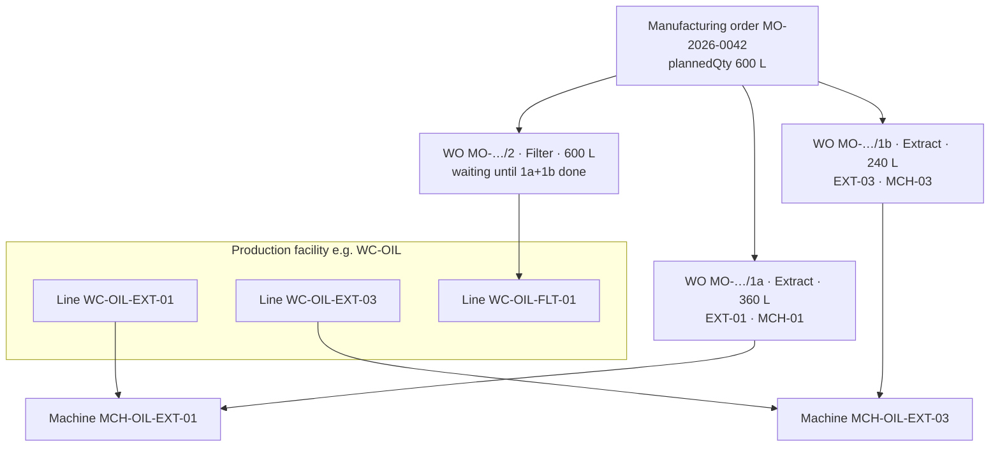
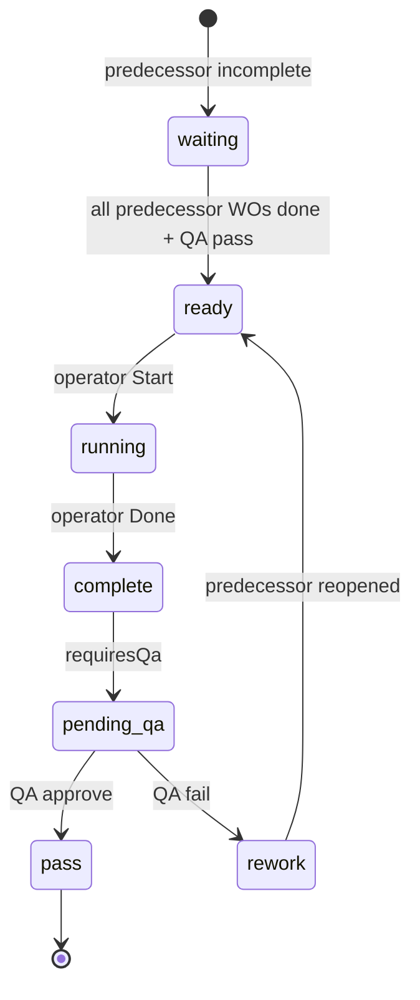

# Multi-machine & parallel manufacturing

**PVS ERP · Manufacturing module**

This document explains how production lines and machines are assigned to manufacturing orders (MOs) and work orders (WOs), and how the same MO can run **in parallel on multiple machines** without picking “multiple machines” on a single work order.

**Related docs:** [`manufacturing-multi-step-bom.md`](manufacturing-multi-step-bom.md) · [`soap-manufacturing-process.md`](soap-manufacturing-process.md) · [`erp-user-manual.md`](erp-user-manual.md)

---

## 1. Design decision (read this first)

| Question | Answer in PVS ERP |
|----------|-------------------|
| Can one work order run on several machines at once? | **No.** Each WO has exactly **one** `lineId` and **one** `machineId`. |
| Can one MO run on several machines at once? | **Yes**, by creating **several work orders** for the same routing step, each on a different line/machine with its own quantity. |
| How do I split qty across machines? | Use **Split operation** on the MO (UI) or `POST …/split-operation` (API). |
| Should we add “select multiple machines” on the MO? | **Not recommended.** Tracking status, output, QA, and machine idle/busy state requires **one machine per WO**. |

This follows Odoo MRP: parallel capacity is modeled as **multiple work orders per operation**, not one WO bound to many machines.

---

## 2. Concept map



| Entity | Role | Parallel relevance |
|--------|------|--------------------|
| **Production facility** | Plant / work center group (e.g. Oil Extraction `WC-OIL`) | MO is created for one facility |
| **Production line** | Logical work center (e.g. `WC-OIL-EXT-01`) | Each parallel WO picks **one** line |
| **Machine** | Physical asset on a line (e.g. `MCH-OIL-EXT-01`) | Each parallel WO picks **one** machine |
| **BOM operation** | Routing step on the BOM (Extract, Filter, Fill) | Split applies **per operation** |
| **Manufacturing order (MO)** | Batch header: product, planned qty, dates | One MO number; qty split across WOs |
| **Work order (WO)** | Executable step on the shop floor | **Unit of parallel execution** |

---

## 3. Data model

### 3.1 Key tables

**`ProductionOrder` (MO)**

| Field | Meaning |
|-------|---------|
| `plannedQty` | Total batch quantity |
| `facilityId` | Where this MO runs |
| `lineId` | Optional MO-level default line (legacy/summary); **per-WO line is authoritative for execution** |

**`WorkOrder` (WO)**

| Field | Meaning |
|-------|---------|
| `workOrderNo` | e.g. `MO-2026-0042/1a` — suffix `a`, `b`, … when split |
| `bomOperationId` | Which routing step this WO belongs to |
| `target` | Qty this WO must produce |
| `plannedSplitQty` | Same as target when created via split |
| `splitSeq` | 0 = unsplit default; 1, 2, … = parallel siblings |
| `lineId` | Assigned production line |
| `machineId` | Assigned machine (optional until start) |
| `status` | `waiting` → `ready` → `running` → `complete` (+ QA) |

**`BomOperation`**

| Field | Meaning |
|-------|---------|
| `seq` | Step order (1, 2, 3…) |
| `blockedByOperationId` | Predecessor operation (Filter blocked by Extract) |
| `lineId` / `machineId` | Default line/machine when MO spawns WOs |
| `requiresQa` | If true, WO stays QA-pending until supervisor approves |

**`BomOperationLine`** (eligible lines)

Lists which production lines **may** run an operation (e.g. Extract allowed on `EXT-01` … `EXT-06`). Used in BOM editor; split UI shows all active lines in the facility.

**`Machine`**

Belongs to exactly one `productionLineId`. A WO’s machine must belong to its chosen line.

### 3.2 Work order numbering after split

For operation seq `1` with three parallel splits:

| workOrderNo | splitSeq | Qty |
|-------------|----------|-----|
| `MO-xxx/1a` | 0 | 200 |
| `MO-xxx/1b` | 1 | 200 |
| `MO-xxx/1c` | 2 | 200 |

Suffix letters are assigned in split order (`a` … `z`).

---

## 4. Two ways to run in parallel

### 4.1 Option A — Split operation (one MO, multiple WOs)

**Best when:** One batch number, one material issue, downstream step waits for **all** parallel extract WOs.

**Flow:**

1. Create MO (e.g. 600 L groundnut extract).
2. Release MO and issue materials.
3. Open MO → **Work orders** tab.
4. Click **Split Extract** (or the operation name).
5. In the modal, add rows:

   | Line | Machine | Qty |
   |------|---------|-----|
   | WC-OIL-EXT-01 | MCH-OIL-EXT-01 | 360 |
   | WC-OIL-EXT-03 | MCH-OIL-EXT-03 | 240 |

6. **Apply split** — backend replaces the single Extract WO with two WOs (`/1a`, `/1b`).
7. **Start** each WO independently when ready.
8. **Filter** WO remains `waiting` until **both** extract WOs are `complete` and QA passed (if required).

**Rule:** Split quantities **must sum exactly** to `MO.plannedQty`.

### 4.2 Option B — Multiple MOs (seed-press oil today)

**Best when:** Each stage is already a **separate BOM/MO** (Extract MO → Filter MO → Pack MO).

Example for 600 L unfiltered target:

| MO | BOM | Line | Qty |
|----|-----|------|-----|
| MO-A | Rev-Oil-Extract-1.0 | WC-OIL-EXT-01 | 360 L |
| MO-B | Rev-Oil-Extract-1.0 | WC-OIL-EXT-03 | 240 L |

Filter MO consumes **pooled** semi-finished stock from both extract MOs. No split modal needed — parallelism is at **MO level**.

Both options are valid; choose based on whether you want one MO number or separate extract batches.

---

## 5. Single machine assignment (no split)

When only **one** line/machine runs a step, use inline dropdowns on the Work orders tab (or **Assign line / machine** in the MO header).

**Per work order:**

1. **Production line** — required before **Start**
2. **Machine** — optional but recommended when multiple machines exist on the line

Saves via:

```http
PATCH /v1/production-orders/{moId}/work-orders/{woId}/assign
Content-Type: application/json

{
  "lineId": "<production-line-id>",
  "machineId": "<machine-id-or-null>"
}
```

**Bulk assign** (same line for all open WOs, with optional per-WO overrides):

```http
PATCH /v1/production-orders/{moId}/assign-line
Content-Type: application/json

{
  "lineId": "<production-line-id>",
  "workOrderAssignments": [
    { "workOrderId": "…", "lineId": "…", "machineId": "…" }
  ]
}
```

**Constraints:**

- Cannot reassign line/machine while WO is `running` or `complete`.
- Machine must belong to the selected line.
- Line must belong to the MO’s facility.

---

## 6. Split operation — backend behaviour

**Endpoint:**

```http
POST /v1/production-orders/{moId}/split-operation
Content-Type: application/json

{
  "bomOperationId": "<operation-id>",
  "splits": [
    { "lineId": "…", "machineId": "…", "qty": 360 },
    { "lineId": "…", "machineId": "…", "qty": 240 }
  ]
}
```

**Algorithm** (`backend/src/lib/mo-work-orders.ts` → `splitOperationWorkOrders`):

1. Validate operation exists.
2. Validate `sum(splits.qty) === MO.plannedQty`.
3. **Delete** all existing WOs for that `bomOperationId` on this MO.
4. **Create** one WO per split row with `lineId`, `machineId`, `target`, `plannedSplitQty`, `splitSeq`.
5. Set initial status to `waiting` if the operation has a blocked-by predecessor, else `ready`.
6. Call `refreshWaitingReady` to unblock downstream steps when predecessors finish.

**Important:** Splitting **replaces** WOs for that operation only. Other operations (Filter, Fill) are untouched. Do not split after WOs are already running or complete.

---

## 7. Dependencies & QA with parallel WOs

### 7.1 Operation dependencies

If operation **Filter** is blocked by **Extract**:

- All WOs with `bomOperationId = Extract` must reach `complete` (+ QA pass if `requiresQa`).
- Only then does the Filter WO move from `waiting` → `ready`.

With splits `1a` and `1b`:

```text
Extract 1a (running) ──┐
Extract 1b (ready)   ──┼──► both complete + QA ──► Filter (ready)
```

### 7.2 QA failure

If QA fails on a WO:

1. Failed WO → `rework`, `qaStatus = fail`.
2. **Predecessor operation** WOs reopened to `ready` (all parallel extract WOs if filter failed downstream).
3. Later operations set back to `waiting`.

Parallel splits share the same dependency rules as a single WO — **all** predecessor WOs for that operation must be done.

---

## 8. Work order lifecycle



**Start requirements:**

- Status must be `ready` (or legacy `queued`).
- `lineId` must be set (UI disables Start until line is chosen).

Each parallel WO is started and completed **independently**.

---

## 9. UI reference

### 9.1 Manufacturing → MO detail → Work orders

| Control | Purpose |
|---------|---------|
| **Production line** / **Machine** dropdowns | Assign one line + machine to this WO |
| **Start** | Begin this WO on its machine |
| **Done** | Mark step complete |
| **QA** | Approve/reject when operation requires QA |
| **Split {operation}** | Open split modal for parallel lines |

### 9.2 Split operation modal

- One row per parallel line.
- Fields: **Line**, **Qty**, **Machine (optional)**.
- **Add line** for 3+ parallel runs (e.g. six extractors).
- **Total** must match MO planned qty.

### 9.3 Assign line / machine (header button)

Shown when any open WO lacks a line. Opens modal to assign line + machine for multiple WOs at once.

---

## 10. Oil extraction example (WC-OIL)

Configured by `npm run db:configure-oil-extraction:dev`:

| Line code | Role | Typical machine |
|-----------|------|-----------------|
| WC-OIL-EXT-01 … EXT-06 | Parallel extraction | MCH-OIL-EXT-01 … 06 |
| WC-OIL-FLT-01 … FLT-03 | Filtering | MCH-OIL-FLT-01 … 03 |
| WC-OIL-FILL | Bottling / pouches | MCH-OIL-FILL |

**Scenario:** MO for 600 L extract, run on two presses in parallel.

**Using split (multi-op BOM on one MO):**

1. MO planned qty = 600.
2. Split Extract → 360 on EXT-01, 240 on EXT-03.
3. Start both WOs same day.
4. When both done (+ QA), Filter WO becomes ready for full 600 L.

**Using separate MOs (current seed-press BOM layout):**

1. MO-1: 360 L on EXT-01.
2. MO-2: 240 L on EXT-03.
3. Create Filter MO when enough unfiltered stock is available.

---

## 11. API summary

| Method | Path | Purpose |
|--------|------|---------|
| `POST` | `/production-orders` | Create MO; spawns one WO per BOM operation |
| `PATCH` | `/production-orders/:id/assign-line` | MO-level + bulk WO line/machine assign |
| `PATCH` | `/production-orders/:id/work-orders/:woId/assign` | Single WO line/machine assign |
| `POST` | `/production-orders/:id/split-operation` | Parallel qty split for one operation |
| `POST` | `/production-orders/:id/work-orders/:woId/start` | Start WO |
| `POST` | `/production-orders/:id/work-orders/:woId/done` | Complete WO |
| `POST` | `/production-orders/:id/work-orders/:woId/qa` | QA pass/fail |
| `GET` | `/production-lines?facilityId=` | Lines for dropdowns |
| `GET` | `/machines?facilityId=` | Machines for dropdowns |

---

## 12. Code locations

| Area | Path |
|------|------|
| WO create / split / assign / QA | `backend/src/lib/mo-work-orders.ts` |
| HTTP routes | `backend/src/routes/manufacturing.ts` |
| Prisma models | `backend/prisma/schema.prisma` (`WorkOrder`, `BomOperation`, `BomOperationLine`, `Machine`) |
| Work orders UI | `erp-portal/src/components/manufacturing/MoWorkOrdersPanel.tsx` |
| Split modal | `erp-portal/src/components/manufacturing/SplitOperationModal.tsx` |
| Line/machine fields | `erp-portal/src/components/manufacturing/WoLineMachineFields.tsx` |
| Bulk assign modal | `erp-portal/src/components/manufacturing/AssignLineModal.tsx` |
| Oil lines + machines seed | `backend/ops-scripts/06-configure-oil-extraction.ts` |
| Site layout constants | `backend/ops-scripts/config/site-layout.ts` |

---

## 13. Limitations & future work

| Topic | Current behaviour |
|-------|-------------------|
| Multi-machine on one WO | Not supported by design |
| Split after start | Not allowed (WOs deleted/recreated on split) |
| Per-step material issue | All BOM components issued at MO release; per-operation issue is planned (see multi-step BOM doc) |
| Machine busy/idle | Updated on WO start/complete when `machineId` is set |
| Legacy BOMs (no operations) | Single WO `/1`; split requires at least one `BomOperation` |
| Eligible lines enforcement | BOM stores eligible lines; split UI currently lists all active facility lines |

---

## 14. Quick decision guide

```text
Need parallel machines on the SAME batch (one MO number)?
  └─► Use Split operation → multiple WOs, one machine each

Need parallel extract but separate batch tracking?
  └─► Create multiple extract MOs on different lines

Need one machine on one step only?
  └─► Use Work orders dropdowns (no split)

Wondering about "pick 3 machines on the MO"?
  └─► Don't — use Split operation with 3 rows instead
```

---

## 15. Glossary

| Term | Meaning |
|------|---------|
| **MO** | Manufacturing order — batch header |
| **WO** | Work order — shop-floor executable unit |
| **Split** | Replace one operation’s WO(s) with several parallel WOs |
| **Operation** | BOM routing step (Extract, Filter, …) |
| **Line** | Production line / work center |
| **Blocked by** | Operation or WO that must finish before the next starts |

---

*Document version 1.0 · Source: `docs/manufacturing-multi-machine-parallel.md`*
