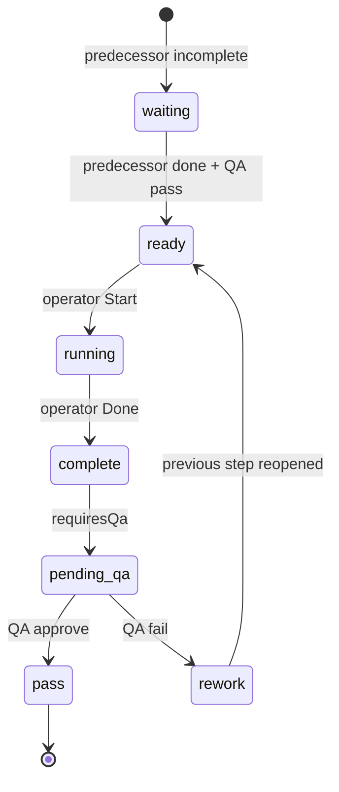

# Multi-step BOMs (Odoo MRP reference)

Design for routing-style BOMs: multiple operations per BOM, work orders per
operation on each MO, operation dependencies, step QA with rollback, and
parallel runs on multiple production lines (e.g. groundnut oil on extraction
line 1 and line 3).

**Odoo docs used as reference**

- [Bill of materials (Operations tab)](https://www.odoo.com/documentation/17.0/applications/inventory_and_mrp/manufacturing/basic_setup/bill_configuration.html)
- [Work order dependencies](https://www.odoo.com/documentation/17.0/applications/inventory_and_mrp/manufacturing/advanced_configuration/work_order_dependencies.html)
- Quality checks on operations (Odoo *Quality* app — control point per operation)

---

## Odoo → PVS ERP mapping

| Odoo 17 | PVS ERP | Notes |
|---------|---------|--------|
| `mrp.bom` | `Bom` | Header: product, variant, output qty, revision |
| `mrp.bom.line` | `BomItem` | Components; optional `bomOperationId` = consume at step |
| `mrp.bom.operation` | `BomOperation` | Named step: sequence, work center, duration, QA flag |
| Operation **Work Center** | `ProductionFacility` + `ProductionLine` + `Machine` | Odoo work center ≈ our line (machines on line) |
| **Blocked By** (operation dependency) | `BomOperation.blockedByOperationId` | Step N cannot start until step N−1 WO is done |
| `mrp.bom` → *Operation Dependencies* | `Bom.operationDependencies` | Master switch (Odoo Miscellaneous tab) |
| Eligible work centers (custom) | `BomOperationLine` | Which lines may run this step (oil: EXT-01, EXT-03) |
| `mrp.production` | `ProductionOrder` | Manufacturing order |
| `mrp.workorder` | `WorkOrder` | One or more per operation (splits for parallel lines) |
| WO state *Waiting for another WO* | `WorkOrder.status = waiting` | Blocked by dependency |
| WO state *Ready* | `WorkOrder.status = ready` | Can start |
| WO state *In progress* | `WorkOrder.status = running` | |
| WO state *Done* | `WorkOrder.status = complete` | |
| `quality.check` pass/fail | `POST .../work-orders/:id/qa` | Fail → reopen previous operation |
| Split same MO across lines | `WorkOrder.splitSeq` + `plannedSplitQty` | Odoo usually splits MO; we allow multiple WOs per operation |

---

## Example: Groundnut oil (WC-OIL) — three separate BOMs

Seed-press oils use **three MOs** (like soap cook + pack), not one multi-op BOM:

| Stage | BOM revision | Product | Input → output | Lines |
|-------|--------------|---------|----------------|-------|
| 1. Extract | `Rev-Oil-Extract-1.0` | `GOIL-UNFILT` (semi) | 400 kg `GNSD` → 100 L unfiltered + 240 kg `GCAK` | `WC-OIL-EXT-01` … `EXT-06` (parallel) |
| 2. Filter | `Rev-Oil-Filter-1.0` | `GOIL` (bulk FG) | 100 L unfiltered → 98 L filtered | `WC-OIL-FLT-01` … `FLT-03` |
| 3. Pack | `Rev-Pack-1.0 (auto)` | `GOIL-*` variants | bulk `GOIL` → bottles/pouches | `WC-OIL-FILL` → Stock Room |

Setup: `npm run db:configure-oil-extraction:dev` then `npm run db:seed-oil-boms:dev`.

Press cake (`GCAK`, `SFCK`, …) is a **by-product** on the extract BOM — `ecommerceEnabled: false`, sold via farm-shop POS only.

**Parallel extraction (600 L unfiltered target)**

| MO | BOM | Line | Batch qty |
|----|-----|------|-----------|
| MO-1 | Rev-Oil-Extract-1.0 | WC-OIL-EXT-01 | 360 L (4 batches) |
| MO-2 | Rev-Oil-Extract-1.0 | WC-OIL-EXT-03 | 240 L (2 batches) |

Use **Split operation** on each extract MO to divide across lines. Filter MO consumes pooled unfiltered stock.

---

## Legacy single-BOM sketch (not used for seed-press oils)

```
BOM: Groundnut oil 1L  (outputQty = 100 L per batch)
├── Operations (seq)
│   1. Extract      → lines WC-OIL-EXT-01, WC-OIL-EXT-03  (parallel OK)
│   2. Filter         → blocked by Extract
│   3. Fill variants  → blocked by Filter, QA required
└── Components
    • Raw groundnut   → consumed at op 1
    • Filter aid      → consumed at op 2
    • Empty bottle    → consumed at op 3
```

**MO for 600 L (single multi-op BOM — Odoo-style, not our seed-press flow)**

| Operation | Work order | Line / machine | Qty |
|-----------|------------|----------------|-----|
| Extract | MO-xxx/1a | WC-OIL-EXT-01 | 360 L |
| Extract | MO-xxx/1b | WC-OIL-EXT-03 | 240 L |
| Filter | MO-xxx/2 | WC-OIL-FLT-01 | 600 L |
| Fill | MO-xxx/3 | WC-OIL-FILL | 600 L |

Filter WO stays `waiting` until **both** extract WOs are `complete` and QA passed.

---

## Work order lifecycle (Odoo-aligned)



**QA fail (rollback)**

1. Mark current WO `rework`, `qaStatus = fail`.
2. Find the **blocking** WO (predecessor operation on same MO).
3. Set predecessor back to `ready` (clear `endTime`, decrement MO `actualQty` if output was logged).
4. Block downstream WOs again (`waiting`).

This mirrors Odoo quality failure handling: production does not advance until
the prior step is repeated satisfactorily.

---

## API surface

| Method | Path | Purpose |
|--------|------|---------|
| GET/POST/PATCH | `/boms` | Include `operations[]` on read/write |
| POST | `/production-orders` | Spawns WOs from BOM operations |
| POST | `/production-orders/:id/split-operation` | Parallel line/machine qty split |
| POST | `/production-orders/:id/work-orders/:woId/start` | Start WO |
| POST | `/production-orders/:id/work-orders/:woId/done` | Complete WO (→ QA if required) |
| POST | `/production-orders/:id/work-orders/:woId/qa` | `{ pass, notes }` |

Legacy BOMs without operations: backfill creates one operation **Manufacture**
(seq 1); MO behaviour unchanged.

---

## Material issue

| Mode | Behaviour |
|------|-----------|
| Single-step / legacy | Issue all BOM components on MO release (current) |
| Multi-step | Issue **direct BOM components** on this MO only (no sub-BOM drill-down). Per-operation issue at active WO is phase 2. |

---

## UI (phased)

1. **BOM editor** — Operations tab (Odoo Operations tab): add/reorder steps, blocked-by, eligible lines, assign components to step.
2. **MO detail** — Work Orders tab: status chips (Waiting / Ready / Running / Done), Plan / Start / Done, QA button.
3. **Split operation** — Modal to divide qty across lines (groundnut example).

---

## Migration & backfill

1. Prisma migration `20260624100000_bom_operations`
2. `npm run db:backfill-bom-operations:dev` — one `Manufacture` operation per existing BOM, link all items

See also [`vps-pending-migrations.md`](vps-pending-migrations.md).
