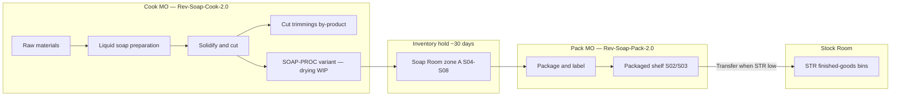

# Soap manufacturing — user guide

How bath soaps are made in PVS ERP: **two manufacturing orders** per batch — cook &
cut to semi-finished bars, **30-day drying**, then pack to retail FG — with automatic
replenishment to the Stock Room.

**Facility:** Soap Room (`WC-SOAP`) · production warehouse `WH-PROD-SOAP` (scan prefix **WSP**)

**Finished product:** Bath Soap (`BSOP`) — one **pack BOM** per 100 g variant

**Semi-finished:** `SOAP-PROC` (Processed Bath Soap) — parent product with one variant per soap type (drying WIP, not sold)

**Batch size:** **40 bars** per MO

---

## Overview — two MOs, not one long MO

Keeping a single MO open for 30 days blocks capacity and mixes WIP with FG. Use:

| MO | BOM | Produces | Typical duration |
|----|-----|----------|------------------|
| **Cook MO** | `Rev-Soap-Cook-2.0` on `SOAP-PROC` variant | 40 drying bars → zone A bins | ~4.5 h (cook + cut) |
| **Pack MO** | `Rev-Soap-Pack-2.0` on `BSOP` variant | 40 packaged retail bars → S02/S03 | ~1 h (after drying) |



Legacy single-BOM `Rev-Soap-1.0` (four ops including dry + pack on one MO) is
**deactivated** by the seed script. Close or cancel any open MOs still on the old
revision before creating new cook/pack MOs.

---

## Soap variants and recipes

Each FG variant has:

1. **Cook BOM** on **`SOAP-PROC`** variant — e.g. parent `SOAP-PROC`, variant `SOAP-PROC-COW-100G-01` (mirrors `BSOP-COW-100G-01`)
2. **Pack BOM** on the BSOP variant — consumes **40 pc** of matching semi, outputs
   **40 × 100 g** packaged bars

### Neem line (Group 1)

| Variant | FG SKU | Semi SKU | Extra ingredient (per 40 bars) |
|---------|--------|----------|--------------------------------|
| Neem & Aloe Vera | `BSOP-NEE-100G-04` | `SOAP-PROC-NEE-100G-04` | Aloe Vera gel **300 g** |
| Neem & Tulasi | `BSOP-NEE-100G-05` | `SOAP-PROC-NEE-100G-05` | — |

**Common raw materials (both variants, per 40 bars):**

| Material | Qty |
|----------|-----|
| Raw Coconut Oil | 2 kg 270 g (2270 g) |
| Raw Gingelly Oil | 480 g |
| Raw Neem Oil | 450 g |
| Raw Caustic Soda | 450 g |
| Raw DMDM | 20 g |
| Raw Flavour Oil | 100 g |

### Herb / fragrance line (Group 2)

| Variant | FG SKU | Semi SKU | Extra ingredient (per 40 bars) |
|---------|--------|----------|--------------------------------|
| Vetivert | `BSOP-VET-100G-07` | `SOAP-PROC-VET-100G-07` | — |
| Baby soap | `BSOP-BAB-100G-08` | `SOAP-PROC-BAB-100G-08` | — |
| Jasmine | `BSOP-JAS-100G-02` | `SOAP-PROC-JAS-100G-02` | — |
| Panchagavya | `BSOP-PAN-100G-06` | `SOAP-PROC-PAN-100G-06` | Tomato juice **1200 g** |
| Cow Milk & Sandal Wood | `BSOP-COW-100G-01` | `SOAP-PROC-COW-100G-01` | Cow milk **1200 g** |

**Common raw materials (all Group 2 variants, per 40 bars):**

| Material | Qty |
|----------|-----|
| Raw Coconut Oil | 2 kg 270 g (2270 g) |
| Raw Castor Oil | 480 g |
| Raw Caustic Soda | 450 g |
| Raw DMDM | 20 g |
| Raw Flavour Oil | 100 g |

Raw material product codes in ERP start with `RAW-SOAP-*` (see Settings → Products).

---

## Manufacturing operations

### Cook MO (`Rev-Soap-Cook-2.0`)

| Seq | Operation | What happens | Typical duration |
|-----|-----------|--------------|------------------|
| 1 | **Cook liquid soap** | All raw materials consumed; cooked to trace | ~3 hours |
| 2 | **Solidify & cut** | Mould, solidify, cut to 100 g bars; log cut scrap | ~1.5 hours |

On MO complete, **40 semi bars** post to the variant's **drying bin** (zone A,
S04–S08) via putaway rule.

### Pack MO (`Rev-Soap-Pack-2.0`)

| Seq | Operation | What happens | Typical duration |
|-----|-----------|--------------|------------------|
| 1 | **Package & store** | Issue 40 semi from drying bin; wrap/label FG | ~1 hour |

Create the pack MO only after bars have dried **≥ 30 days** in inventory.

### By-product: cut trimmings

After cutting, trim scrap is recorded as variant **`BSOP-CUT-TRIM-01`** (Cut trimmings)
— about **800 g** per batch (~20 g × 40 bars). This appears on the **cook** BOM
by-products list and can be posted when the cut work order completes.

---

## Physical layout (Soap Room)

| Zone / shelf | Purpose |
|--------------|---------|
| **A / S04–S08** | **Drying bins** — `SOAP-PROC` variants rest here for ≥ 30 days |
| **A / S02, S03** | **Packaged buffer** — labelled FG (S02 bins 01–05, S03 bins 01–02) |
| **A / other** | General production / WIP |

Scan prefix **WSP** — example drying bin: `WSP.AS05.03` = zone A, shelf S05, bin 03.

---

## Day-to-day workflow

### 1. Cook MO — raw to drying semi

1. **Manufacturing → Production orders → New**
2. Product: **`SOAP-PROC`**, variant matching the soap (e.g. Cow Milk) — BOM **`Rev-Soap-Cook-2.0`**
3. Planned qty = **40** (one batch)
4. **Release** → issue raw materials from `WH-PROD-SOAP`
5. Run work orders: **Cook** → **Solidify & cut** (log cut by-product if prompted)
6. **Complete** the cook MO — 40 semi bars land in the assigned **drying bin**

### 2. Drying (inventory hold)

No MO is open during drying. Semi stock sits in zone A (S04–S08) for **≥ 30 days**.
Use **Inventory** to confirm qty and bin location before packing.

### 3. Pack MO — semi to retail FG

1. **New production order** on the **BSOP variant** — BOM **`Rev-Soap-Pack-2.0`**
2. Planned qty = **40**
3. **Release** → issue **40 pc** semi from drying bins (FIFO)
4. Run **Package & store** work order
5. **Complete** — 40 packaged bars post to **A/S02** (or S03) per variant putaway rule

### 4. Stock Room replenishment (automatic)

When a **Stock Room (`STR`)** bin for a soap variant falls below **80 pieces**, a
**transfer order** is auto-created:

- **From:** Soap Room packaged bin (`WSP.AS02.0n` / `WSP.AS03.0n`)
- **To:** The monitored STR bin for that variant

Operators pick and execute the transfer in **Inventory → Transfer orders**.

To change the minimum level: **Settings → Stock rules** (tag `soap`).

---

## Setup (IT / admin)

Run once after deploy or catalog import:

```bash
cd backend
npm run ops:site-setup              # Soap Room facility + WH-PROD-SOAP
npx tsx scripts/seed-soap-room-bins.ts
npm run ops:putaway-fg              # STR bins + putaway rules for all variants
npm run db:seed-soap-boms:dev       # Raw products, semi products, cook/pack BOMs, stock rules
```

VPS (compiled):

```bash
docker compose exec backend npx tsx scripts/seed-soap-room-bins.ts
docker compose exec backend npm run ops:putaway-fg:dist
docker compose exec backend node dist/scripts/seed-soap-boms.js   # after build
```

Recipe source of truth: `backend/scripts/config/soap-bom-recipes.ts`

---

## Related documentation

- [Multi-step BOMs (operations)](manufacturing-multi-step-bom.md)
- [Operational site layout](../backend/ops-scripts/README.md)
