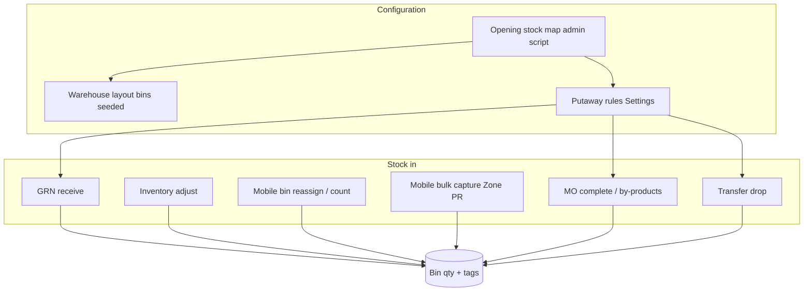

# Stock location assignment in the ERP portal

How products and variants are assigned to warehouse bins in PVS ERP: physical model, configuration, inbound flows, moves, manufacturing, and fulfilment.

**Design principle:** Physical stock always lives in **bins** (`Bin.qty`). Each bin is tagged with a parent `productId`, an optional `variantId`, and a quantity. Product-level **stock on hand** is derived from bin totals (variant SOH is tracked separately for packed SKUs).

---

## Physical model

Every stock location is:

**Warehouse → Zone → Shelf → Bin**

Example: `STR.AS01.06` = Stock Room (`STR`), zone `A`, shelf `S01`, bin `06`.

Each bin record holds:

| Field | Meaning |
|-------|---------|
| `productId` | Parent SKU (e.g. `WSS`) |
| `variantId` | Optional pack SKU (e.g. `WSS-1KG-01`), or `null` for bulk/raw |
| `qty` | Physical quantity in that slot |
| `reservedQty` | Quantity reserved for picks / transfers |



---

## Parent vs variant (important distinction)

| Level | Bin tag | Example use |
|-------|---------|-------------|
| **Bulk parent** | `productId = WSS`, `variantId = null` | Raw seeds (kg) for manufacturing |
| **Pack variant** | `productId = WSS`, `variantId = WSS-1KG-01` | Packed units offered for sale |

The portal enforces this in adjust/reassign UI and on the backend: bulk raw must use **untagged parent bins**; packed variants use **variant-tagged bins**. MO replenishment and bulk material issue consider **parent-only** bins — sale variants are not consumed for manufacturing.

---

## 1. Warehouse layout (empty slots)

**Portal:** Warehouse page (`/warehouse`)

Shows the bin tree for each warehouse (STR, farm shop, godowns, production lines, etc.). Bins are created by seed scripts from layout definitions (e.g. STR zones A–D, shelf/bin counts, scan codes like `STR.AS01.06`). Initially most bins are **empty** — no product tag, qty 0.

Bin layout tools on that page view/edit structure; **stock assignment** happens when something is **received into** a bin.

**Related code:** `backend/src/lib/stock-room-layout.ts`, `backend/src/lib/godown-layouts.ts`, seed scripts under `backend/src/scripts/`.

---

## 2. Putaway rules (default destination)

**Portal:** Settings → Putaway rules (`/settings?section=putaway`)

Each rule defines: *when this product (or variant) arrives, send it to…*

| Field | Meaning |
|--------|---------|
| Product / variant | SKU the rule applies to (variant-specific rules beat parent rules) |
| To warehouse | e.g. `STR`, `WH-FARM` |
| To zone | Optional — e.g. zone `PR` as staging before a fixed bin is known |
| To bin | Optional fixed bin — if set, stock always goes there |

**Resolution order** (backend):

1. Active putaway rule for `(productId, variantId)` — variant-specific
2. Active putaway rule for `(productId, variantId = null)` — product-level
3. Fallback: any active storage warehouse + auto-pick best bin

Putaway rules drive:

- GRN receive default bin suggestions
- MO completion (where finished goods land)
- Transfer drop (destination if operator does not scan a bin)
- Daily production auto-posting

**Related code:** `backend/src/lib/putaway.ts` — `resolvePutawayDestination`, `pickBestBin`

---

## 3. Opening stock (one-time floor walk)

**Not a daily portal screen** — admin script:

```bash
npm run db:seed-opening-stock:dev
```

Uses a static map (`variantSku|warehouse|zone|shelf|bin`) from the floor walk (`backend/src/lib/opening-stock-assignments.ts`):

1. **Assigns** variant + qty to that bin (`applyBinReassign`)
2. **Creates** a matching **putaway rule** pinning that variant to that bin

Many STR bins show qty **1234** and a fixed variant location after seeding (placeholder opening qty).

**Related code:** `backend/src/scripts/seed-opening-stock.ts`, `backend/src/lib/bin-stock-update.ts`

---

## 4. Zone PR bulk capture (mobile — pin staging SKUs)

**Portal:** Mobile → Bulk capture (`/m/bulk-capture`)

Handles variants whose putaway rule still points to **STR Zone PR** (zone known, **no fixed bin yet**):

1. Operator scans a bin barcode and enters qty
2. Backend assigns stock to that bin **and updates the putaway rule** to pin that bin
3. Variant drops off the pending list

Normal path for moving staged pack SKUs from “zone PR” into real shelf locations.

**API:** `GET /v1/zone-pr-variants`, `POST /v1/zone-pr-variants/capture`

**Related code:** `backend/src/routes/inventory.ts`, `erp-portal/src/mobile/screens/MobileBulkCapture.tsx`

---

## 5. GRN receive (procurement inbound)

**Portal:** Procurement → GRN receive

On receive, **putaway hints** suggest where stock should go:

- **Default bin** from putaway rules + `pickBestBin` (prefer existing bin for same SKU, else empty slot in the rule’s zone)
- Operator can **split qty across bins** or override bin choice
- Batch-tracked raw material may go through **stock lots** (FIFO) inside the chosen bin

**Related code:** `backend/src/lib/grn-receive.ts`, `backend/src/lib/stock-lots.ts`

---

## 6. Inventory adjust (desktop)

**Portal:** Inventory → Adjust stock

Add or remove qty at a chosen level:

- Pick **parent** or **variant** SKU
- Pick **warehouse** and **bin** (only bins that match: variant bins for variants, untagged parent bins for bulk)
- Empty bins can be **tagged** on first positive adjustment

Used for corrections, ad-hoc receipts, and manufacturing replenishment shortcuts.

**API:** `POST /v1/inventory/adjust`

**Related code:** `erp-portal/src/pages/Inventory.tsx` (`AdjustStockModal`), `backend/src/routes/inventory.ts`

---

## 7. Mobile bin ops (recount / reassign)

**Portal:** Mobile bin and count screens

| Action | API | Effect |
|--------|-----|--------|
| **Reassign** | `POST /v1/bins/:id/reassign` | Swap what is in a bin (clears old product, sets new product/variant/qty, ledger + audit) |
| **Recount** | Bin count endpoint | Change qty in place for what is already tagged there |

Floor tools when physical reality does not match the system.

**Related code:** `erp-portal/src/mobile/screens/MobileBin.tsx`, `MobileCount.tsx`

---

## 8. Warehouse bulk zone panel

**Portal:** Warehouse → bulk zone stock panel

Edit many bins in a zone at once (barcode + qty). Same backend reassignment/adjust logic, batch-oriented for a whole zone.

**Related code:** `erp-portal/src/components/warehouse/BulkZoneStockPanel.tsx`

---

## 9. Transfers (move between locations)

**Portal:** Transfers (`/transfers`)

Moves stock **bin to bin** across warehouses:

| Kind | Typical use |
|------|-------------|
| **Replenishment** | Auto-created on MO release — pulls **bulk parent** stock from STR/godown to production line |
| **Putaway** | Auto-created when MO output needs to move from production line to storage per putaway rule |
| **Manual** | Operator-created moves |

Flow: **pick** decrements source bin → **drop** increments destination bin (putaway rule or scanned bin). Destination bin is tagged with product/variant from the transfer line.

**Related code:** `backend/src/routes/transfers.ts`, `backend/src/lib/facility-ops.ts`

---

## 10. Manufacturing (production line bins)

**Portal:** Manufacturing → order detail, inventory trail

| Step | Location behaviour |
|------|-------------------|
| **Release** | Shortage check counts **bulk parent** bin qty at production line; creates replenishment TOs from parent-only source bins |
| **Issue** | Consumes from production-line bins (bulk parent for raw; variant-scoped only for special cases e.g. SOAP semi on pack MOs) |
| **Complete** | Posts FG into receive bin on production line or putaway destination |
| **By-products** | Use putaway rules like normal receipts |

**Related code:** `backend/src/routes/manufacturing.ts`, `backend/src/lib/facility-ops.ts` (`stockMapForMoLeaves`, `allocateReplenishmentForProduct`)

See also: [manufacturing-inventory-storage.md](./manufacturing-inventory-storage.md)

---

## 11. Sales fulfilment (outbound assignment)

**Portal:** Picking / packing (fulfilment module)

Pick lists assign each order line to specific bins via `splitAcrossBins`:

- Variant orders → variant-tagged bins first
- Bulk parent lines → parent-only bins
- Largest free qty first; can split one line across multiple bins

Assignment for **picking**, not putaway — decides *where* to pull from for dispatch.

**Related code:** `backend/src/lib/pick-list-helpers.ts`, `backend/src/routes/fulfilment.ts`

---

## Portal quick reference

| Task | Where |
|------|--------|
| Set default landing bin for a SKU | **Settings → Putaway rules** |
| See what is where | **Warehouse** tree, **Inventory** |
| Correct a bin | **Inventory adjust** or **mobile bin/count** |
| Pin Zone PR variants to shelves | **Mobile bulk capture** |
| Receive PO stock | **Procurement → GRN receive** |
| Move between warehouses | **Transfers** |
| MO material / FG locations | **Manufacturing → inventory trail** |

---

## Related documents

- [manufacturing-inventory-storage.md](./manufacturing-inventory-storage.md) — MO release, issue, complete, transfer orders
- [warehouse-location-barcodes.md](./warehouse-location-barcodes.md) — barcode formats and scan prefixes
- [erp-user-manual.md](./erp-user-manual.md) — full portal user manual

---

*Generated from ERP portal behaviour as of June 2026.*
